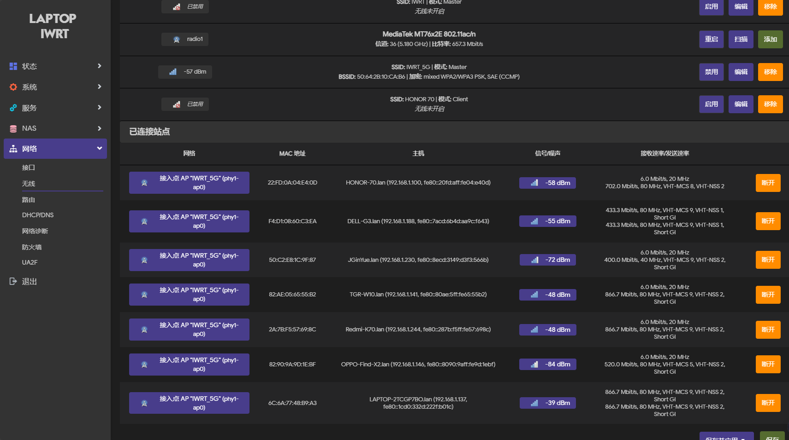

# 基于OpenWRT路由器的校园网突破设备限制实践总结

许多校园网会对学生接入的数量进行限制, 学生无法自由地连接多台设备.通过在OpenWRT路由器上进行适当的配置, 学生可以有效地突破设备限制, 实现多设备的稳定连接.

## 0 准备工作

### 0.1 要准备的东西

- 能够刷入OpenWRT系统的路由器, 如小米r3g, 极路由2等；
- 一台电脑, 带RJ45网口；
- 一根网线.
- 学会面向百度、CSDN、恩山论坛、chatGPT等解决问题.

### 0.2 !!!前置知识!!!

**!!!重要提示!!!有不懂的一定要回看这个深入浅出的教学视频!!!**

- [【正片】面对校园网的多设备检测, 「我」的解决方案是——](https://www.bilibili.com/video/BV1yr4meeENt/)
  

### 0.3 编译OpenWRT(选做, 不推荐)

走UA2F方案需要编译OpenWRT；走UA3F方案则可略过.(后来补充: 不推荐ua2f)

- 编译源选择ImmortalWRT.
  [immortalwrt/immortalwrt: An opensource OpenWrt variant for mainland China users.](https://github.com/immortalwrt/immortalwrt)

- 编译平台选择任意linux, 笔者选择在win11安装wsl2 Ubuntu-22.04.
  [超详细Windows10/Windows11 子系统（WSL2）安装Ubuntu20.04（带桌面环境）_wsl安装ubuntu20.04-CSDN博客](https://blog.csdn.net/weixin_44301630/article/details/122390018)

- 安装编译环境.
```shell
sudo bash -c 'bash <(curl -s https://build-scripts.immortalwrt.org/init_build_environment.sh)'
```
  或者
```shell
sudo apt update -y && sudo apt full-upgrade -y
sudo apt install -y ack antlr3 asciidoc autoconf automake autopoint binutils bison build-essential bzip2 ccache clang cmake cpio curl device-tree-compiler ecj fastjar flex gawk gettext gcc-multilib g++-multilib git gnutls-dev gperf haveged help2man intltool lib32gcc-s1 libc6-dev-i386 libelf-dev libglib2.0-dev libgmp3-dev libltdl-dev libmpc-dev libmpfr-dev libncurses-dev libpython3-dev libreadline-dev libssl-dev libtool libyaml-dev libz-dev lld llvm lrzsz mkisofs msmtp nano ninja-build p7zip p7zip-full patch pkgconf python3 python3-pip python3-ply python3-docutils python3-pyelftools qemu-utils re2c rsync scons squashfs-tools subversion swig texinfo uglifyjs upx-ucl unzip vim wget xmlto xxd zlib1g-dev zstd
```

- 拉取源码并更新feeds.
```shell
git clone -b openwrt-23.05 --single-branch --filter=blob:none https://github.com/immortalwrt/immortalwrt
cd immortalwrt
./scripts/feeds update -a
./scripts/feeds install -a
git clone https://github.com/Zxilly/UA2F.git package/UA2F
git clone https://github.com/CHN-beta/rkp-ipid.git package/rkp-ipid
./scripts/feeds update -a
./scripts/feeds install -a
```

- 更改内核md5标识的生成为官方的.
  [ImmortalWrt Firmware Selector](https://firmware-selector.immortalwrt.org/)
```shell
vim vermagic
ce481810a6ef20561573585f35096f96

vim include/kernel-defaults.mk
grep '=[ym]' $(LINUX_DIR)/.config.set | LC_ALL=C sort | mkhash md5 > $(LINUX_DIR)/.vermagic
# grep '=[ym]' $(LINUX_DIR)/.config.set | LC_ALL=C sort | mkhash md5 > $(LINUX_DIR)/.vermagic
cp $(TOPDIR)/vermagic $(LINUX_DIR)/.vermagic

vim package/kernel/linux/Makefile
STAMP_BUILT:=$(STAMP_BUILT)_$(shell $(SCRIPT_DIR)/kconfig.pl $(LINUX_DIR)/.config | mkhash md5)
#STAMP_BUILT:=$(STAMP_BUILT)_$(shell $(SCRIPT_DIR)/kconfig.pl $(LINUX_DIR)/.config | mkhash md5)
STAMP_BUILT:=$(STAMP_BUILT)_$(shell cat $(LINUX_DIR)/.vermagic)
```

- 配置固件设置`make menuconfig`.
  - Network -> Routing and Redirection ->
    ua2f（必要）
  - Kernel modules –> Other modules –>
    kmod-rkp-ipid
  - Network –> Firewall –> 选中 ->
    iptables-mod-conntrack-extra;
    iptables-mod-filter;
    iptables-mod-ipopt;
    iptables-nft;
    iptables-mod-u32;
  - Network ->
    ipset

  自行选配需要的软件包, 比如`ua2f`、`argon`、`ttyd`、`fileassistant`等, 以及认证脚本可能使用到的`python3-requests`、`python3-gmpy2`.
  [OpenWRT好用的插件（名称及功能中英文对照表）_openwrt插件对照表-CSDN博客](https://blog.csdn.net/gianttj/article/details/132535039)
  [【新提醒】最近在编译immortalwrt整理一下软件包对照-软路由,x86系统,openwrt(x86),Router OS 等-恩山无线论坛](https://www.right.com.cn/FORUM/thread-8387547-1-1.html)
  [【新提醒】Openwrt软件包全量解释-OPENWRT专版-恩山无线论坛](https://www.right.com.cn/FORUM/thread-8384897-1-1.html)
  [软路由Openwrt make menuconfig编译配置界面详解及推荐配置_哔哩哔哩_bilibili](https://www.bilibili.com/video/BV1Yt4y1i7fa/?spm_id_from=333.880.my_history.page.click&vd_source=5772c4820f003a0086e0ff6ed14cf3a8)

- 内核编译配置`make kernel_menuconfig -j$(nproc) V=cs`.
  - Networking support->Networking options-> Network packet filtering framework(Netfilter)-> Core Netfilter Configuration ->
    Netfilter NFNETLINK interface
    Netfilter LOG over NFNETINK interface
    Netfilter connection tracking support
    Connection tracking netlink interface
    NFQUEUE and NFLOG intergration with Connection Tracking

- UA2F需要修改`.config`.
  [Zxilly/UA2F: Change User-Agent to F-string on OpenWRT router to prevent being detected. (github.com)](https://github.com/Zxilly/UA2F)
```shell
vim .config
CONFIG_NETFILTER_NETLINK_GLUE_CT=y
```

- 编译前屏蔽主机环境变量(适用于wsl).
  [\[OpenWrt Wiki\] Build system setup WSL](https://openwrt.org/docs/guide-developer/toolchain/wsl)
```shell
PATH=/usr/local/sbin:/usr/local/bin:/usr/sbin:/usr/bin:/sbin:/bin
echo $PATH
```

- 开始编译`make download -j$(nproc) V=cs && make -j$(nproc) V=cs`.
- 若编译成功, 则固件在对应的文件夹`bin/targets/ramips/` 下.

## 1 刷入Breed、OpenWRT

不同的硬件刷入Breed、OpenWRT的步骤不同, 本篇以小米r3g和极路由2为例, 其他硬件请自行搜索.

### 1.1 小米r3g

[小米路由器R3G刷（openwrt/原厂）保姆级教程_路由器_什么值得买 (smzdm.com)](https://post.smzdm.com/p/a6plozqe/)
[小米路由器3G R3G 刷入Breed和OpenWrt 20.02.2 的记录_小米r3g-CSDN博客](https://blog.csdn.net/michaelchain/article/details/124263191)
[2023小米路由器R3G刷机breed和openwrt详细教程 - 哔哩哔哩 (bilibili.com)](https://www.bilibili.com/read/cv26996006/?jump_opus=1)

- 刷入开发版
  [MiWiFi – 下载](https://www.miwifi.com/miwifi_download.html)

- 获取SSH权限, 这个m3g电信版本可能比较特殊, 只能用米家绑定路由器.
  [【路由器】绑定小米WiFi APP (mi-img.com)](https://cdn.cnbj1.fds.api.mi-img.com/ics-resources/articles/60559916ec317cb4ee2cf1f9.html)
  [【路由器】绑定米家APP流程 (mi-img.com)](https://cdn.cnbj1.fds.api.mi-img.com/ics-resources/articles/5fec3cf11019330eae6c2753.html)

- 选择`breed-mt7621-xiaomi-r3g.bin`, 通过SSH上传, 刷入, 重启.
  [breed-mt7621-xiaomi-r3g.bin](https://breed.hackpascal.net/breed-mt7621-xiaomi-r3g.bin)

### 1.2 极路由2

[极路由贰HC5761怎么样 极路由贰HC5761刷入OpenWrt全流程_什么值得买 (smzdm.com)](https://post.smzdm.com/p/awkqngnm/)

- 固件升级
  [极路由各版本官方固件下载_极路由1S/贰/3/3Pro/4/GO/极路由X官方稳定版ROM固件包集合- (xgiu.com)](https://www.xgiu.com/hiwifi_os_down)
  [求极路由2 手动升级官方新版固件方法-极路由无线路由器及网络设备-恩山无线论坛 (right.com.cn)](https://www.right.com.cn/FORUM/thread-8122592-1-1.html)

- 获取SSH权限
  [极路由1s (HC5661A) 获取SSH权限刷入Breed - 哔哩哔哩 (bilibili.com)](https://www.bilibili.com/read/cv24920537/)
  [极路由ROOT local-ssh利用工具 (hiwifi.wtf)](http://www.hiwifi.wtf/)

- HC5761A可以刷HC5661A, 选择下载`breed-mt7628-hiwifi-hc5661a.bin`, 通过SSH上传, 刷入, 重启.
  [Index of / (hackpascal.net)](https://breed.hackpascal.net/)

## 2 OpenWRT配置

### 2.1 系统联网

[OpenWrt设置路由器联网（无线） - 知乎 (zhihu.com)](https://zhuanlan.zhihu.com/p/342887364)

### 2.2 空间扩容（选做）

极路由2空间不大可以外接U盘扩容.

- 安装软件包`fdisk` `e2fsprogs` `kmod-usb-storage` `kmod-fs-ext4` `kmod-scsi-generic`.
- 为U盘分区, 格式化为ext4.
  [openwrt下挂载USB存储设备 - hello_yaosir - 博客园 (cnblogs.com)](https://www.cnblogs.com/Yaosir/p/14843091.html)
  [OpenWRT 挂载 硬盘 U盘 - 无小空空 - 博客园 (cnblogs.com)](https://www.cnblogs.com/Cryan/p/15806654.html)
- 选择U盘扩展overlay或作为系统根目录.
  [从U盘启动OpenWrt并扩容路由器系统分区空间 - OpenWrt开发者之家](https://www.openwrt.pro/post-559.html)

### 2.3 安装常用软件包

- 界面美化：luci-app-argon-config
  web终端：luci-app-ttyd
  文件助手：luci-app-fileassistant
```shell
opkg update
opkg install luci-app-ttyd luci-app-argon-config luci-app-fileassistant
opkg install https://github.com/lucikap/luci-app-nettask/blob/main/luci-app-nettask_2.0.0-1_all.ipk
```
  [OpenWRT好用的插件（名称及功能中英文对照表）_openwrt插件对照表-CSDN博客](https://blog.csdn.net/gianttj/article/details/132535039)
  [【新提醒】最近在编译immortalwrt整理一下软件包对照-软路由,x86系统,openwrt(x86),Router OS 等-恩山无线论坛](https://www.right.com.cn/FORUM/thread-8387547-1-1.html)
  [【新提醒】Openwrt软件包全量解释-OPENWRT专版-恩山无线论坛](https://www.right.com.cn/FORUM/thread-8384897-1-1.html)
  [软路由Openwrt make menuconfig编译配置界面详解及推荐配置_哔哩哔哩_bilibili](https://www.bilibili.com/video/BV1Yt4y1i7fa/?spm_id_from=333.880.my_history.page.click&vd_source=5772c4820f003a0086e0ff6ed14cf3a8)

### 2.4 校园网相关配置

由于UA2F与clash冲突, 而反dpi检测依赖clash, 起初不确定校园网是否存在dpi检测而使用了UA2F方案, 在成功使用一天后, 被抽样封禁（10mins）加入黑名单（上线直接封10mins）, 最终选择UA3F.
(事后补充: clash要求较高, 小米r3g的mt7621也勉强使用clash的国内代理方案, 因此推荐大家直接考虑mt7621/mt7628以及更好的芯片)

#### 2.4.1 UA2F（需从源码编译）、UA3F二选一

UA2F的安装过程简单, UA3F的安装过程则需要足够的毅力.

- 安装UA2F：`luci-app-ua2f`
  自定义启动脚本
```shell
# 启用 UA2F
uci set ua2f.enabled.enabled=1
# 自动配置防火墙（默认开启）（建议开启）
uci set ua2f.firewall.handle_fw=1
# 处理 443 端口流量（默认关闭）, 443 端口出现 http 流量的概率较低
uci set ua2f.firewall.handle_tls=1
# 处理微信的 mmtls（默认开启）（建议关闭）
uci set ua2f.firewall.handle_mmtls=0
# 处理内网流量（默认开启）, 防止在访问内网服务时被检测到.（建议开启）
uci set ua2f.firewall.handle_intranet=1
# 禁用 Conntrack 标记（默认开启）会降低性能, 但有助于和其他修改 Connmark 的软件共存
uci set ua2f.main.disable_connmark=0
# 提交规则
uci commit ua2f
# 开机自启ua2f
service ua2f enable
# 启动ua2f
service ua2f start
```

- 安装UA3F：`ua3f`
```shell
opkg install curl libcurl luci-compat
export url='https://blog.sunbk201.site/cdn' && sh -c "$(curl -kfsSl $url/install.sh)"
service ua3f reload
```
  [SunBK201/UA3F CDN by jsDelivr - A free, fast, and reliable Open Source CDN](https://cdn.jsdelivr.net/gh/SunBK201/UA3F@master/)
  [GitHub - SunBK201/UA3F: Implementation of the next generation of HTTP User-Agent modification methodology.](https://github.com/SunBK201/UA3F)
  安装时若显示`Connection reset prematurely`说明域名不可访问, 要修改`install.sh`, 使各个文件路径与`cdn.jsdelivr.net/gh/SunBK201/UA3F@master/`下的文件路径一一对应.(提前下载好uaf包, 见[ua3f_install.sh](./ua3f_install.sh))
  
- UA3F依赖：`shellcrash`
  [ShellClash 加密防检测教程 (notion.site)](https://sunbk201public.notion.site/ShellClash-d199f43309e44ab4b4d4ece01dbac3bb)
  [ShellCrash/README_CN.md at stable · juewuy/ShellCrash (github.com)](https://github.com/juewuy/ShellCrash/blob/stable/README_CN.md)


```shell
opkg update
opkg install iptables nftables crontab net-tools ubus iproute-doc
export url='https://fastly.jsdelivr.net/gh/juewuy/ShellCrash@master' && sh -c "$(curl -kfsSl $url/install.sh)" && source /etc/profile &> /dev/null
crash # 启动shellcrash进行配置
```
  2 内核功能设置 ->
    1 运行模式 Redir
    4 只代理常用 否
  6 导入配置文件 ->
    [ua3f-cn.yaml (jsdelivr.net)](https://cdn.jsdelivr.net/gh/SunBK201/UA3F@master/clash/ua3f-cn.yaml) 或者
    [ua3f-global-enhance.yaml (jsdelivr.net)](https://cdn.jsdelivr.net/gh/SunBK201/UA3F@master/clash/ua3f-global-enhance.yaml)（防dpi检测配置）
  9 更新/卸载 ->
    2 切换内核文件 -> Meta
    4 安装本地面板 -> Meta基础
  `192.168.1.1:9999`, 设置sock5代理端口1080.

  - 自定义启动脚本
```shell
# 启动 UA3F
uci set ua3f.enabled.enabled=1
uci commit ua3f
service ua3f start
```

#### 2.4.2 其他配置

- 防火墙组件：`kmod-rkp-ipid`、`iptables-mod-conntrack-extra`、`iptables-mod-filter`、`kmod-ipt-ipopt`、`iptables-mod-ipopt`、`iptables-mod-u32`、`iptables-nft`、`ipset`.

```shell
opkg update
opkg install kmod-rkp-ipid iptables-mod-conntrack-extra iptables-mod-filter kmod-ipt-ipopt iptables-mod-ipopt iptables-mod-u32 iptables-nft ipset
```

- 自定义启动脚本

```shell
#防火墙
iptables -t nat -A PREROUTING -p udp --dport 53 -j REDIRECT --to-ports 53
iptables -t nat -A PREROUTING -p tcp --dport 53 -j REDIRECT --to-ports 53
# 如果有ipv6, 加上这些
# [ -n "$(command -v ip6tables)" ] && ip6tables -t nat -A PREROUTING -p udp --dport 53 -j REDIRECT --to-ports 53
# [ -n "$(command -v ip6tables)" ] && ip6tables -t nat -A PREROUTING -p tcp --dport 53 -j REDIRECT --to-ports 53

# 防 IPID 检测
iptables -t mangle -N IPID_MOD
iptables -t mangle -A FORWARD -j IPID_MOD
iptables -t mangle -A OUTPUT -j IPID_MOD
iptables -t mangle -A IPID_MOD -d 0.0.0.0/8 -j RETURN
iptables -t mangle -A IPID_MOD -d 127.0.0.0/8 -j RETURN
# 由于本校局域网是 A 类网, 所以我将这一条注释掉了, 具体要不要注释结合你所在的校园网内网类型
# iptables -t mangle -A IPID_MOD -d 10.0.0.0/8 -j RETURN
iptables -t mangle -A IPID_MOD -d 172.16.0.0/12 -j RETURN
iptables -t mangle -A IPID_MOD -d 192.168.0.0/16 -j RETURN
iptables -t mangle -A IPID_MOD -d 255.0.0.0/8 -j RETURN
iptables -t mangle -A IPID_MOD -j MARK --set-xmark 0x10/0x10

# 防时钟偏移检测
iptables -t nat -N ntp_force_local
iptables -t nat -I PREROUTING -p udp --dport 123 -j ntp_force_local
iptables -t nat -A ntp_force_local -d 0.0.0.0/8 -j RETURN
iptables -t nat -A ntp_force_local -d 127.0.0.0/8 -j RETURN
iptables -t nat -A ntp_force_local -d 192.168.0.0/16 -j RETURN
iptables -t nat -A ntp_force_local -s 192.168.0.0/16 -j DNAT --to-destination 192.168.1.1

# 通过 iptables 修改 TTL 值
iptables -t mangle -A POSTROUTING -j TTL --ttl-set 64

# iptables 拒绝 AC 进行 Flash 检测
iptables -I FORWARD -p tcp --sport 80 --tcp-flags ACK ACK -m string --algobm --string " src=\"http://1.1.1." -j DROP
```

- 系统时间NTP服务配置
  绑定NTP服务器 LAN
  候选NTP服务器
    ntp.aliyun.com
    time1.cloud.tencent.com
    time.ustc.edu.cn
    cn.pool.ntp.org
- 重启, 系统日志查看rpk-ipid是否工作, uaf是否工作, 终端查看shellclash是否工作.

#### 2.4.3 校园网认证脚本

本校园网为锐捷网页认证, 目前支持的项目为[HustWebAuth](https://www.right.com.cn/forum/thread-8265282-1-1.html), 但由于所在校园网可以直接ping通脚本检查联网的ip, 学力有限最终放弃该脚本.在综合参考前人的脚本后编写分别实现了python和shell脚本[Barabama/RuijieEportal: 锐捷 eportal web 认证脚本 (github.com)](https://github.com/Barabama/RuijieEportal).

- Python实现登录
  本校园网仅支持加密密码登录, 目前python脚本的加密实现在x86和mipsle均测试通过, 使用python脚本前可能需要修改脚本中的`IP`为所在学校的联网IP.
  安装依赖`python3``python3-requests``python3-gmpy2`
```shell
opkg update
opkg install python3 python3-requests python3-gmpy2
python main.py login -u $USER -p $PASSWORD -e -c # -e 为加密登录
python main.py logout
```

[SWUOSA/ruijie-authentication: 西南大学校园网自动登录脚本, 基于Python](https://github.com/SWUOSA/ruijie-authentication)
[ehxu/Ruijie_JMU: 锐捷 ePortal Web 认证自动登录脚本（Linux & Windows）](https://github.com/ehxu/Ruijie_JMU)
[callmeliwen/RuijiePortalLoginTool: 集美大学锐捷 ePortal Web 认证自动登录脚本](https://github.com/callmeliwen/RuijiePortalLoginTool)

- Shell实现登录
  shell脚本的加密实现之前在mipsle上存在问题, 原因在于通过`mipsel-linux-gcc`交叉编译的文件一直无法在路由器上运行. 
  直到看到[锐捷自动认证 & 交叉编译至mipsel](https://blog.mapotofu.cn/archives/ruijie_auto_auth_and_cross_compile_to_mipsel.html)才明白需要选择路由器系统的编译工具链. 在这个过程中需要将gmp编译进工具链中, 经过一番折腾总算解决了. 

  - 交叉编译`encrypt.c`
```shell
## gmp编译进工具链
sudo apt install m4
cd /home/ubar
wget https://downloads.immortalwrt.org/releases/23.05.4/targets/ramips/mt7621/immortalwrt-sdk-23.05.4-ramips-mt7621_gcc-12.3.0_musl.Linux-x86_64.tar.xz # 下载系统对应sdk
tar -xvf immortalwrt-sdk-23.05.4-ramips-mt7621_gcc-12.3.0_musl.Linux-x86_64.tar.xz # 解压sdk
vim ~/.bashrc  # 打开.bashrc文件添加以下内容来配置环境变量
export STAGING_DIR=/home/ubar/immortalwrt-sdk-23.05.4-ramips-mt7621_gcc-12.3.0_musl.Linux-x86_64/staging_dir/toolchain-mipsel_24kc_gcc-12.3.0_musl
export PATH=$PATH:$STAGING_DIR/bin
source ~/.bashrc
mipsel-openwrt-linux-gcc --version # 查看gcc是否安装成功

wget https://gmplib.org/download/gmp/gmp-6.3.0.tar.xz # 下载gmp
tar -xvf gmp-6.3.0.tar.xz
cd /home/ubar/gmp-6.3.0/
sudo ./configure --host=mipsel-openwrt-linux-gnu --prefix=/usr/local/mipsel-gmp --enable-static --disable-shared \
# --disable-assembly --disable-fat --disable-profiling # 如果配置或make失败尝试添加参数
sudo make -j$(nproc)
sudo make install

## 交叉编译encrypt.c
mipsel-openwrt-linux-gcc -I/usr/local/mipsel-gmp/include -L/usr/local/mipsel-gmp/lib encrypt.c -o encrypt_mipsel -lgm
```

  - 脚本登录
```shell
  # 修改web_hust.sh中的校园IP和加密文件encrypt_mipsel路径
  chmod +x encrypt_mipsel # 首次调用时需要获取权限
  sh ./web_hust.sh $USER $PASSWORD
  sh ./web_hust.sh logout
```


[锐捷自动认证 & 交叉编译至mipsel](https://blog.mapotofu.cn/archives/ruijie_auto_auth_and_cross_compile_to_mipsel.html)
[immortalwrt-23.05.4-ramips-mt7621-...](https://downloads.immortalwrt.org/releases/23.05.4/targets/ramips/mt7621/)
[gmplib](https://gmplib.org/)
[linux库文件安装报错](https://blog.csdn.net/qq_40565735/article/details/108844357)

## 3 结果

一切准备就绪, 和室友一起享受成果吧！



## 4 附录

最终, 笔者所在宿舍路由器为小米r3g, 完整的配置过程如下: 

- 安装必要软件
```shell
opkg update
# 安装常用软件包
opkg install luci-app-ttyd luci-app-argon-config luci-app-fileassistant
opkg install https://github.com/lucikap/luci-app-nettask/blob/main/luci-app-nettask_2.0.0-1_all.ipk

# 安装UA3F
opkg install curl libcurl luci-compat
export url='https://blog.sunbk201.site/cdn' && sh -c "$(curl -kfsSl $url/install.sh)"
# ./ua3f_install.sh # 另一种安装方法
service ua3f reload

# 安装ShellCrash
opkg install iptables nftables crontab net-tools ubus iproute-doc
export url='https://fastly.jsdelivr.net/gh/juewuy/ShellCrash@master' && sh -c "$(curl -kfsSl $url/install.sh)" && source /etc/profile &> /dev/null
crash # 启动shellcrash进行配置

# 安装防火墙组件
opkg install kmod-rkp-ipid iptables-mod-conntrack-extra iptables-mod-filter kmod-ipt-ipopt iptables-mod-ipopt iptables-mod-u32 iptables-nft ipset

# 安装Python
opkg install python3 python3-requests python3-gmpy2
```

- 本地wsl交叉编译`encrpyt.c`为`encrypt_mipsel`
```shell
## gmp编译进工具链
sudo apt install m4
cd /home/ubar
wget https://downloads.immortalwrt.org/releases/23.05.4/targets/ramips/mt7621/immortalwrt-sdk-23.05.4-ramips-mt7621_gcc-12.3.0_musl.Linux-x86_64.tar.xz # 下载系统对应sdk
tar -xvf immortalwrt-sdk-23.05.4-ramips-mt7621_gcc-12.3.0_musl.Linux-x86_64.tar.xz # 解压sdk
vim ~/.bashrc  # 打开.bashrc文件添加以下内容来配置环境变量
export STAGING_DIR=/home/ubar/immortalwrt-sdk-23.05.4-ramips-mt7621_gcc-12.3.0_musl.Linux-x86_64/staging_dir/toolchain-mipsel_24kc_gcc-12.3.0_musl
export PATH=$PATH:$STAGING_DIR/bin
source ~/.bashrc
mipsel-openwrt-linux-gcc --version # 查看gcc是否安装成功

wget https://gmplib.org/download/gmp/gmp-6.3.0.tar.xz # 下载gmp
tar -xvf gmp-6.3.0.tar.xz
cd /home/ubar/gmp-6.3.0/
sudo ./configure --host=mipsel-openwrt-linux-gnu --prefix=/usr/local/mipsel-gmp --enable-static --disable-shared \
# --disable-assembly --disable-fat --disable-profiling # 如果配置或make失败尝试添加参数
sudo make -j$(nproc)
sudo make install

## 交叉编译encrypt.c
mipsel-openwrt-linux-gcc -I/usr/local/mipsel-gmp/include -L/usr/local/mipsel-gmp/lib encrypt.c -o encrypt_mipsel -lgm
```

- OpenWRT本地启动脚本配置

```shell
#防火墙
iptables -t nat -A PREROUTING -p udp --dport 53 -j REDIRECT --to-ports 53
iptables -t nat -A PREROUTING -p tcp --dport 53 -j REDIRECT --to-ports 53
# 如果有ipv6, 加上这些
# [ -n "$(command -v ip6tables)" ] && ip6tables -t nat -A PREROUTING -p udp --dport 53 -j REDIRECT --to-ports 53
# [ -n "$(command -v ip6tables)" ] && ip6tables -t nat -A PREROUTING -p tcp --dport 53 -j REDIRECT --to-ports 53

# 防 IPID 检测
iptables -t mangle -N IPID_MOD
iptables -t mangle -A FORWARD -j IPID_MOD
iptables -t mangle -A OUTPUT -j IPID_MOD
iptables -t mangle -A IPID_MOD -d 0.0.0.0/8 -j RETURN
iptables -t mangle -A IPID_MOD -d 127.0.0.0/8 -j RETURN
# 由于本校局域网是 A 类网, 所以我将这一条注释掉了, 具体要不要注释结合你所在的校园网内网类型
# iptables -t mangle -A IPID_MOD -d 10.0.0.0/8 -j RETURN
iptables -t mangle -A IPID_MOD -d 172.16.0.0/12 -j RETURN
iptables -t mangle -A IPID_MOD -d 192.168.0.0/16 -j RETURN
iptables -t mangle -A IPID_MOD -d 255.0.0.0/8 -j RETURN
iptables -t mangle -A IPID_MOD -j MARK --set-xmark 0x10/0x10

# 防时钟偏移检测
iptables -t nat -N ntp_force_local
iptables -t nat -I PREROUTING -p udp --dport 123 -j ntp_force_local
iptables -t nat -A ntp_force_local -d 0.0.0.0/8 -j RETURN
iptables -t nat -A ntp_force_local -d 127.0.0.0/8 -j RETURN
iptables -t nat -A ntp_force_local -d 192.168.0.0/16 -j RETURN
iptables -t nat -A ntp_force_local -s 192.168.0.0/16 -j DNAT --to-destination 192.168.1.1

# 通过 iptables 修改 TTL 值
iptables -t mangle -A POSTROUTING -j TTL --ttl-set 64

# iptables 拒绝 AC 进行 Flash 检测
iptables -I FORWARD -p tcp --sport 80 --tcp-flags ACK ACK -m string --algobm --string " src=\"http://1.1.1." -j DROP

# 启动 UA3F
uci set ua3f.enabled.enabled=1
uci commit ua3f
service ua3f start

# 启动Clash
crash -s start

# 登录校园网
cd ~/RuijiEportal
sh web_hust.sh $USER $PASSWORD
# python main.py login -u $USER -p $PASSWORD -e -c
```

## 5 致谢

非常感谢[YeWenXuan64](https://space.bilibili.com/332842679)的引路, 让笔者接触到软路由这个新世界. 笔者在本科时期也曾淘宝gswifi来应对校园网, 但时代在进步技术在进步, 在有了指引之后, 在有点计算机基础上, 笔者决定花一些时间实践而不是买办.如今笔者的网络环境得到了有效改善, 惠及舍友.在实践探索的道路上遇到了不少困难, 但庆幸互联网络发达, 笔者站在[SunBK201](https://github.com/SunBK201)、[褐瞳さん](https://hetong-re4per.com/posts/multi-device-detection/)、[QU头](https://www.cnblogs.com/aquawius/articles/16759604.html)等前人的肩膀上收获了这些成果, 这些也促使我写下这篇总结, 并将它分享, 为社区尽一些绵薄之力.

